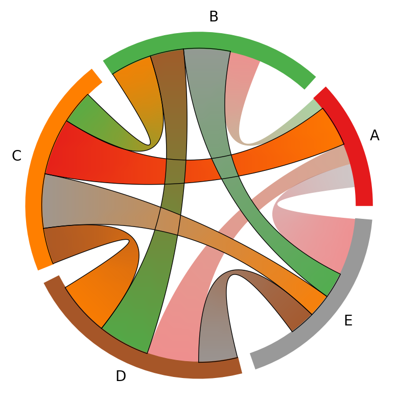

# Roundabout

Visualize matrices as chord diagrams aka "radial network graphs".

Inspired by various examples, ultimately going back to:
http://circos.ca/presentations/articles/vis_tables1/

Also note the similar package https://github.com/Silmathoron/mpl_chord_diagram. I wanted to do things slightly differently, so I decided to start from scratch and make it into a hobby project.

## How to use

```sh
pip install <repo>
```

```python
from roundabout import draw_chord_diagram

labels = "ABCDE"
matrix = np.random.randint(low=5, high=25, size=(5, 5))
colors = plt.get_cmap("Set1")(np.linspace(0, 1, 5))
threshold = 10

draw_chord_diagram(
    matrix,
    labels=labels,
    colors=colors,
    spacing="proportional",
    padding=5,
    sort_rows="mincross",
    threshold=threshold,
)
```


